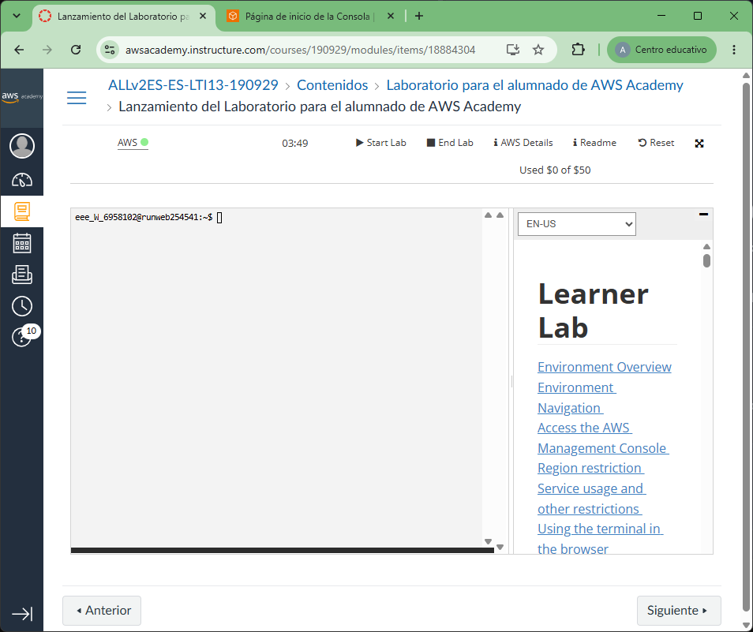
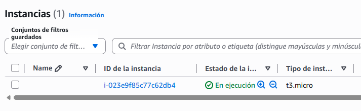

# Publica tu propio servicio RSS

## Introducción

En esta práctica crearás un feed RSS, lo publicarás en un servidor Ubuntu con Apache en AWS y lo seguirás desde un lector de RSS.

> **Importante:** usaremos una instancia EC2 (una máquina virtual) y Apache. No crearemos un contenedor Docker. En esta práctica, subir los archivos "al servidor" significa copiarlos al directorio que Apache publica en la web.

## Objetivos

- Crear una instancia Ubuntu accesible desde Internet y asignarle una dirección IP pública estática.
- Crear un feed RSS 2.0 con al menos cuatro noticias originales y publicarlo en Apache.
- Comprobar el feed con el validador oficial y suscribirse a él desde Feedly.

## 1. Entra en AWS Academy y abre la consola de AWS

1. Abre [AWS Academy](https://awsacademy.instructure.com/) e inicia sesión con las credenciales que te haya proporcionado tu profesor.
2. Entra en el curso de esta asignatura y abre el laboratorio de AWS, normalmente llamado **AWS Academy Learner Lab** o con un nombre similar.
3. Pulsa **Start Lab** y espera a que el laboratorio aparezca como iniciado. Mientras se inicia, el indicador puede mostrar un estado de espera.
4. Cuando el laboratorio esté activo, pulsa **AWS** para abrir la consola de AWS en una nueva pestaña.
5. Comprueba que la consola se ha abierto con la cuenta temporal del laboratorio antes de continuar. Trabaja solo con los recursos necesarios para esta práctica y detén el laboratorio cuando termines.



## 2. Prepara el servidor Ubuntu en AWS
### 2.1. Crea una instancia EC2

1. Entra en la consola de AWS y abre **EC2**.
2. Pulsa **Lanzar la instancia** y asigna un nombre, por ejemplo, `servidor-rss`.
3. En **Imágenes de aplicaciones y sistemas operativos**, selecciona una imagen oficial **Ubuntu** (Ubuntu Server 26.04 LTS).
4. Elige un tipo de instancia pequeño permitido para tu cuenta del centro. Nosotros usaremos **t3.micro**.
5. **Claves para conectarte por SSH**
   1. Si ya las has creado, intenta reutilizar las que ya tienes seleccionándolas del desplegable. Esto implica que tienes que recuperar el fichero `.pem` que ya creaste.
   2. Si nunca has hecho este paso o has perdido el fichero `.pem`, crea un par de claves nuevas. Solo tienes que hacer clic en el menú y establecer un nombre. Para esta práctica usamos `asir-rss.pem`. Descarga el fichero `.pem`, guárdalo en un lugar seguro y no lo compartas ni lo subas a Classroom.
6. En la configuración de red, crea o selecciona un grupo de seguridad con estas reglas de entrada:
   - **SSH**, puerto `22`, desde cualquier lugart (`0.0.0.0/0`).
   - **Permitir el tráfico HTTP desde Internet**, puerto `80`.
7. Ya podemos hacer clic sobre el botón **Lanzar instancia**.

> **Importante**. Guarda ese fichero `.pem` en algún sitio donde lo encuentres porque no lo podrás volver a descargar.
> No está todo perdido: siempre puedes crear un par de claves nuevas.



### 2.2. Conéctate la dirección pública de la instancia

En este momento ya puedes conectarte a la instancia usando la dirección IPv4 pública o el DNS público que aparecen en sus detalles. Estas direcciones son automáticas y pueden cambiar si detienes y vuelves a iniciar la instancia, por lo que no es una dirección fija.

### 2.3. Conéctate por SSH e instala Apache

Abre bash en tu ordenador, desde la carpeta donde guardaste el fichero `.pem`. Sustituye el nombre de la clave y la IP por los tuyos. La cuenta predeterminada de Ubuntu en la imagen de AWS es `ubuntu`.

```bash
# Abre una sesión segura en la instancia usando la clave privada y la IP pública estática.
ssh -i .\asir-rss.pem ubuntu@IP_PUBLICA
```

Date cuenta que el modificador `-i` sirve para indicar el fichero de tu clave. Después se pone el nombre del usuario, que es `ubuntu`, una arroba, y finalmente la ip o el DNS público que AWS nos da de la instancia.

Si tras la ejecución de la orden anterior aparece una pregunta sobre la autenticidad del servidor, escribe `yes` solo si la IP corresponde a tu instancia. Ya dentro de Ubuntu, ejecuta:

```bash
# Actualiza la lista de paquetes disponibles en Ubuntu.
sudo apt update
# Instala el servidor web Apache sin pedir confirmación interactiva.
sudo apt install apache2 -y
# Configura Apache para iniciarse automáticamente con el sistema operativo.
sudo systemctl enable apache2
# Muestra el estado de Apache para comprobar que está activo.
sudo systemctl status apache2
```

Para comprobar que Apache funciona, abre el navegador y escribe `http://IP_PUBLICA`, sustituyendo `IP_PUBLICA` por la dirección IPv4 pública de tu instancia.

Si aparece la página predeterminada de Apache, el servidor responde. Si no carga, revisa que Apache esté activo y que el grupo de seguridad permita tráfico HTTP por el puerto 80.

## 3. Crea el fichero RSS

Un feed RSS es un documento XML que describe una fuente y sus noticias. En clase seguimos el [tutorial de RSS de Eniun](https://www.eniun.com/tutorial-rss/); consúltalo para repasar los elementos y el formato.

Puedes escoger, por ejemplo, tecnología y ciberseguridad, videojuegos, deportes, música, medioambiente, ciencia, viajes o noticias de tu centro. Redacta **al menos cuatro noticias completas**: cada una debe tener un título claro y una descripción comprensible, con varios datos o ideas y buena ortografía. Puedes usar una IA u otra herramienta como apoyo, pero revisa y adapta el resultado: el feed debe ser coherente y el contenido no debe copiar artículos ajenos.

Guarda el fichero como `feed.xml`. Puedes ayudarte para crearlo con Visual Studio Code.

## 4. Sube los ficheros al servidor por SSH

Abre la terminal en la carpeta dondes esté el fichero `feed.xml`. La siguiente orden copia el fichero a la carpeta personal del usuario `ubuntu` de la instancia de AWS:

```bash
# Copia el fichero feed.xml a la carpeta personal de Ubuntu.
scp -i asir-rss.pem feed.xml ubuntu@IP_PUBLICA:~
```

Ahora en el servidor ubuntu donde se está ejecutando Apache, conéctate con SSH (si no estabas ya conectado):

```bash
# Nos conectamos al contenedor de ubuntu
ssh -i asir-rss.pem ubuntu@IP_PUBLICA
```

Dentro del contenedor, cambiamos el usuario y grupo del fichero así como sus permisos. Y movemos el fichero `feed.xml` a la carpeta `/var/www/html` para que Apache pueda trabajar con él.

```bash
# Mueve el fichero `feed.xml` a la carpeta donde de Apache
sudo mv ~/feed.xml /var/www/html/feed.xml
# Cambia el usuario dueño y el grupo
sudo chown www-data:www-data /var/www/html/feed.xml
# Cambia los permisos
sudo chmod 644 /var/www/html/feed.xml
```

Comprueba en el navegador que `http://IP_PUBLICA/` sigue mostrando tu página de Apache recién instalado en Ubuntu y que `http://IP_PUBLICA/feed.xml` abre el feed. Si ya existía un `index.html` de Apache, el segundo comando lo reemplaza en la instancia.

## 5. Valida el feed XML

1. Abre el [W3C Feed Validation Service](https://validator.w3.org/feed/).
2. Introduce la dirección pública completa de tu feed: `http://IP_PUBLICA/feed.xml`.
3. Pulsa **Check**. El validador debe poder acceder al archivo y no mostrar errores de formato.
4. Si hay errores, lee el mensaje y corrige `feed.xml` en tu ordenador. Vuelve a subirlo con el comando `scp` y el comando SSH de instalación del paso 4, y valida la dirección de nuevo.

Si el validador no puede descargar el feed, prueba primero la dirección en una ventana privada del navegador y revisa que la instancia siga encendida, Apache esté activo y el puerto 80 esté abierto. No subas una captura de un feed que todavía tenga errores sin corregir.

## 6. Publica también `index.html`

Copia y pega el siguiente código a un fichero llamado `index.html`. Es una página sencilla que enlaza el feed desde el `<head>` mediante la línea 8. **Completa correctamente esa línea**.

```html hl_lines="7-8"
<!doctype html>
<html lang="es">
<head>
  <meta charset="utf-8" />
  <meta name="viewport" content="width=device-width, initial-scale=1" />
  <title>Mi servicio RSS</title>
  
  <!-- COMPLETA ESTA LÍNEA A CONTINUACIÓN CORRECTAMENTE -->
  <link rel="alternate" title="RSS" href="" type="application/rss+xml" />

</head>
<body>
  <h1>Mi servicio RSS</h1>
  <p>Bienvenido a mi canal de noticias. Suscríbete al feed para recibir las novedades.</p>
  <p><a href="feed.xml">Ver el feed RSS</a></p>
</body>
</html>
```

El atributo `href=""` indica que dónde está el feed respecto de esta página `index.html`. Por eso, en el paso 4 ambos se copian a `/var/www/html/`. Si cambias el nombre o la ubicación del feed, actualiza también `href` para que coincida.

Como hicimos con el fichero `feed.xml`, ahora tenemos que subir este otro fichero `index.html` y configurar su usuario, grupo y permisos.

```bash
# Nos conectamos al contenedor de ubuntu
ssh -i asir-rss.pem ubuntu@IP_PUBLICA
```

Dentro del contenedor movemos el fichero `index.xml` y lo configuramos para que Apache pueda trabajar con él tal y como hicimos con el fichero `feed.xml`.

```bash
# Mueve el fichero `index.html` a la carpeta donde de Apache
sudo mv ~/index.html /var/www/html/index.html
# Cambia el usuario dueño y el grupo
sudo chown www-data:www-data /var/www/html/index.html
# Cambia los permisos
sudo chmod 644 /var/www/html/index.html
```

## 7. Sigue tu propio RSS

1. Entra en un cliente RSS.
2. Usa **Añadir contenido** o la opción equivalente para añadir una fuente de tu cliente.
3. Pega la dirección directa `http://IP_PUBLICA/feed.xml` y selecciona el resultado que corresponde a tu canal.
4. Pulsa **Follow** o **Seguir**.
5. Comprueba que aparecen tus cuatro noticias. Puedes actualizar el feed después y volver a cargarlo para observar cómo llegan las novedades.

## 8. Entrega en Classroom

Envía estos tres elementos por Classroom al profesor:

- El fichero `feed.xml` que has publicado.
- El fichero `index.html` que has publicado.
- Una captura de pantalla de Feedly donde se vea el nombre de tu fuente y las noticias recibidas.

Antes de entregar, confirma que el feed se abre desde Internet, supera la validación XML y aparece en Feedly. **No entregues ni compartas el fichero `.pem`**, porque es una clave privada de acceso al servidor.
